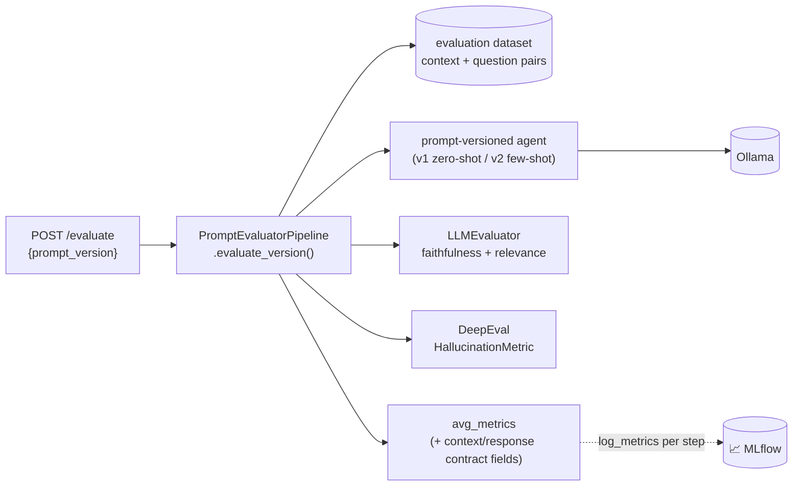

# 🧪 PromptOps Lab


> Standalone laboratory for A/B regression-testing prompt versions against a local LLM.

## Problem & Goal

Prompt changes are easy to make and easy to silently regress — a rewording meant to fix one failure case can quietly hurt faithfulness or relevance on others. PromptOps Lab turns "does this new prompt actually help?" into a repeatable, scored comparison instead of a gut check: run a fixed evaluation dataset against a named prompt version, get faithfulness/relevance/hallucination scores back, and compare versions over time via MLflow.

## Architecture



Each dataset item is scored individually and logged to MLflow as a step within a single run (`eval_{prompt_version}`), so you can see per-item variance, not just the aggregate.

## Concrete Metrics (example run, `phi3:latest`)

| Metric | v1 (zero-shot) | v2 (few-shot) |
|---|---|---|
| Avg. Faithfulness | reported per run via `/evaluate` | reported per run via `/evaluate` |
| Avg. Relevance | reported per run via `/evaluate` | reported per run via `/evaluate` |
| Avg. Hallucination | reported per run via `/evaluate` | reported per run via `/evaluate` |

> Numbers are dataset- and model-dependent by design — run `/evaluate` for both versions and diff the MLflow runs rather than trusting static numbers in a README.

## Extension Points

- **LLM Provider**: switch from local Ollama to a cloud endpoint via `llmops_common.client.factory.get_llm_client` (`BaseLLMClient` contract).
- **New prompt versions**: add a new version string + corresponding prompt template to the agent; `PromptEvaluatorPipeline.evaluate_version()` is version-agnostic.
- **New evaluation dataset**: swap `load_dataset()`'s source file for a domain-specific set of `{context, question}` pairs.

## Setup

```bash
# via the shared platform infra
cd ../../LLMOpsPlatform/llmops-platform && docker compose up -d ollama mlflow

cd ../../PromptOpsLab/promptops-lab
python -m venv .venv && source .venv/bin/activate  # .venv\Scripts\activate on Windows
pip install -e .
uvicorn promptops_lab.api:app --reload --port 8003
```

Or via the full stack (`docker compose up --build` from `LLMOpsPlatform/llmops-platform`), and interact through the **PromptOps Lab** tab in the [Studio UI](../../LLMOpsUI).
